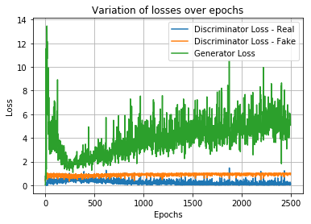
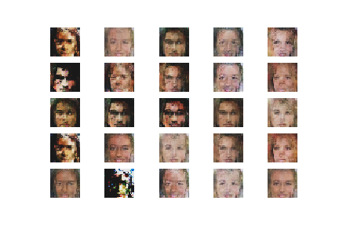
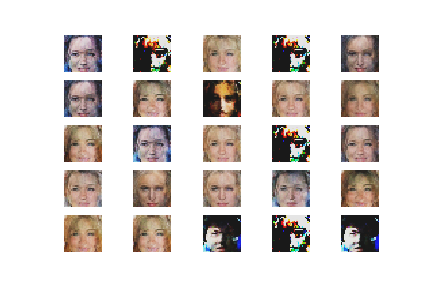
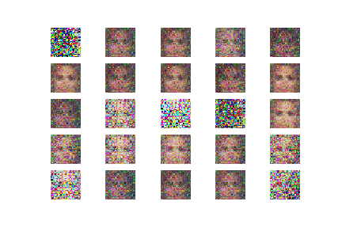

# Generating Faces With A Deep Convolutional Generative Adversarial Network

Recently I found a great repo posted by Erik Lindernoren [https://github.com/eriklindernoren/Keras-GAN/blob/master/dcgan/dcgan.py] providing wire frame code for a whole bunch of different GANs. I've wanted to give GANs a try for a while so, I grabbed the DCGAN code from this repo, a celebrity faces data set posted by Mirantha Jayathilaka at [https://www.floydhub.com/mirantha/datasets/celeba]. Following methods and using code from the DCGAN and gan_rgb folders in Erik Lindernoren's repo, I set up the the DCGAN code to train on RGB images from the Celeba data set. 

On a hunch, I wanted to modify the generator network to accept random noise in the same size and shape as the image it is generating, rather than a random vector of length 100. My thought was, why 100? I couldn't not think of any theoretical reason to keep the length of the random vector to 100, or any guidence on the size. Without reseraching, I decided to make the random input the same size and dimentions as the output that is to be produced. Following Erik's code, I used his crop and resize pre-processing to generate and discriminate with 28x28 pixel images cropped close to the faces. 

## New Noise object
I wanted to use a noise object the same size and dimentions as the prefered output, rather than the random 1 d vector with 100 numbers. It was just the first thing I thought of to try different. 

## New Models for Generator and Discriminator
Additionally, I tried new models for the generator and discriminator. For the generator, I experimented with a non-fully convolutional layer, but a model that looks somewhat simmilar to an image classifier, but ends with a reshpaing of a single vector into a 28x28 RGB image matrix. It contained about 26 million parameters. For the discriminator, I tried something similar, building a model with early convolutional layers, and latter fully connected layers. The discriminator model had about 56 million parameters.

The idea here was to make a smart and stable enough generator to compete with a stable discriminator that has the potential to be more intelligent. I thought that this would create a difficult set up for the generator, but not so difficutl that there would not be enough error signal from the discriminator to train on. Essentially, training a forger really hard to beat a very smart discriminator. 

This may seem a bit weird, but I was working with the assumption that really small generator loss is not nessesarity the goal, but getting good looking pictures fast is. The values of the generator loss will not consistantly relate to a particular image qualtiy, as the meaning of the generator loss changes as the dicriminator learns. 

## Run it
I ran for a total of 2,900 times on a laptop with 16 GB ram and a quad-core i5. This is a pretty humble effort, and although the resulting images weren't great, I was surprised with the resutls given the hardware I used and the small amount of time. You can definately learn alot about gans without logging into AWS and spending some cash on a big cluster, but for great high-resolution results, I think something like that might be nesseary. 

## Resulting Images
The images weren't too bad, but still lacked some realism and consistancy by the time I stopped trianing. The convolutional / fully connected generator produced a particular style of image, kind of cubist. This is likely from the size of the filters and the fact that the image is only 28x28, so the general idea shows some promise for scaling up to higher res. Also, there wasn't much variation in the produced images. Each training iteration, they where different, but within a single batch there was a lot of similarity. 

The training process was hard to get a hold of, as generator loss was pretty variable and not very simple to relate to image qualtiy. In general, the generator loss increased after an initial decrease, but ocilated up and down as well. One pattern I noticed was ocilations in the generator loss, and the better images seemed to be coming out somewhere on the "down swing" of the generator loss, but not always on the minimum. Based on my experiece training this model, I am pretty sure results could be drastically different with changes to model training and balance. I think there is a lot to gained in how good and how fast the model will learn to generate images with better training procudures.

**Training Results**

**Generator (26 MM parameters) and Discriminator (56 MM parametes) with multiple convolutional layers at 2900 Epochs. Generating from 28x28x3 niose array, same size and shape as output**

**Generator (26 MM parameters) and Discriminator (56 MM parametes) with multiple convolutional layers at 2750 Epochs. Generating from 28x28x3 niose array, same size and shape as output**

For comparison, Erik's repo contained a GAN desiged to produce these 28x28 celeb images from a non-convoutional network. That model starts with a vector of 100 random number and uses a generator model with about 1 million trainable prameters, and a discriminator with about 3 million parameters. Although the model is much simpiler, it still captures a lot of the face structure. However, there is clear noise still present in the images, which was long gone from the convolutional network outputs by this epoch. Here are the non-convoutional results from epoch 3000.

**Generator (1 MM parameters) and Discriminator (3 MM parameters) with without convolutional layers at 2900 Epochs. Generating from 1D noise vector length 100**

The convolutional model made better looking pictures at 3000 epochs, but I suspect it is overfitted and is getting close to spitting back just copies of images. It still has a long way to go to realistic and needs more consistant, and more diverse results. Better training, model balance, and more computing power could lead to a method capable of generating more realistic and higher reslotuion images. Learning more about the input noise, training procudures, and balancing the generator and discrimiator model could greatily improve the quality, consistancy, and shorten the training time for GANs. 

